# Documentação Técnica: Simulação de Lixeira Linux

**Autores:**
* Maria Moreira Mané (Nº Mec: 125102)
* Claudino José Martins (Nº Mec: 127368)

Este documento detalha a arquitetura interna, o fluxo de dados e as decisões de design do script `recycle_bin.sh`.

---

## 1. Arquitetura do Sistema

O sistema de lixeira é centrado num diretório oculto na `HOME` do utilizador, `~/.recycle_bin`. Esta abordagem isola os dados eliminados do resto do sistema de ficheiros.

### Diagrama de Arquitetura

O diagrama abaixo ilustra os componentes principais do sistema e as suas interações.

*(Nota: Terá de criar esta imagem e guardá-la como `system_architecture_diagram.png` na sua pasta `screenshots/`)*

* **`files/`**: Armazena o conteúdo real dos ficheiros e diretórios eliminados. Cada item é renomeado para o seu `unique_id` para evitar conflitos de nome.
* **`metadata.db`**: Um ficheiro CSV que atua como a "base de dados". Mantém a ligação entre o `unique_id` e os dados originais do ficheiro (caminho original, nome, etc.).
* **`config`**: Ficheiro de texto simples (formato `CHAVE=VALOR`) que guarda as definições do utilizador, como a quota (`MAX_SIZE_MB`) e o tempo de retenção (`RETENTION_DAYS`).
* **`recyclebin.log`**: Um registo cronológico de todas as ações (DELETE, RESTORE, EMPTY) para depuração e auditoria.

---

## 2. Esquema de Metadados (metadata.db)

O ficheiro `metadata.db` é um CSV com 8 colunas, conforme os requisitos do projeto. O cabeçalho é definido na função `initialize_recyclebin`.

**Cabeçalho:**
`ID,ORIGINAL_NAME,ORIGINAL_PATH,DELETION_DATE,FILE_SIZE,FILE_TYPE,PERMISSIONS,OWNER`

* **ID**: O identificador único (`timestamp_randomstring`) usado para nomear o ficheiro na pasta `files/`.
* **ORIGINAL_NAME**: O nome original do ficheiro (ex: `relatorio.txt`).
* **ORIGINAL_PATH**: O caminho absoluto completo de onde o ficheiro foi eliminado (ex: `/home/user/Documentos/relatorio.txt`).
* **DELETION_DATE**: Timestamp da eliminação (formato `YYYY-MM-DD HH:MM:SS`).
* **FILE_SIZE**: Tamanho do ficheiro em bytes.
* **FILE_TYPE**: O tipo de item ("file" ou "directory").
* **PERMISSIONS**: As permissões originais em formato octal (ex: `644`, `755`).
* **OWNER**: O dono e grupo originais (ex: `claudino:claudino`).

---
## 3. Fluxo de Dados e Algoritmos Principais

Esta secção detalha a lógica por trás das operações mais complexas através de fluxogramas.

---

### Fluxograma da Operação `initialize_recyclebin`

Este fluxograma mostra a lógica de verificação inicial, criando a estrutura de diretórios e ficheiros (`.recycle_bin`, `files`, `metadata.db`, `config`) apenas se ela ainda não existir.

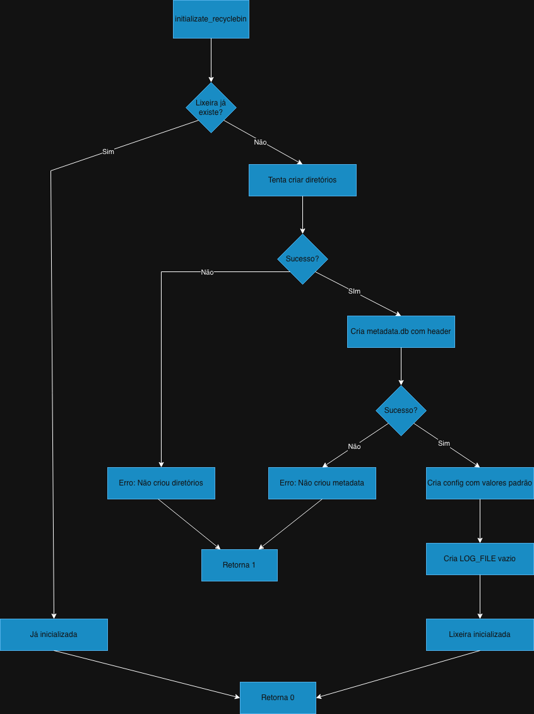

---

### Fluxograma da Operação `delete_file`

O fluxograma abaixo descreve o processo desde a receção do comando `delete` até ao registo do ficheiro nos metadados, incluindo validações de permissão, existência e a chamada ao `check_quota`.

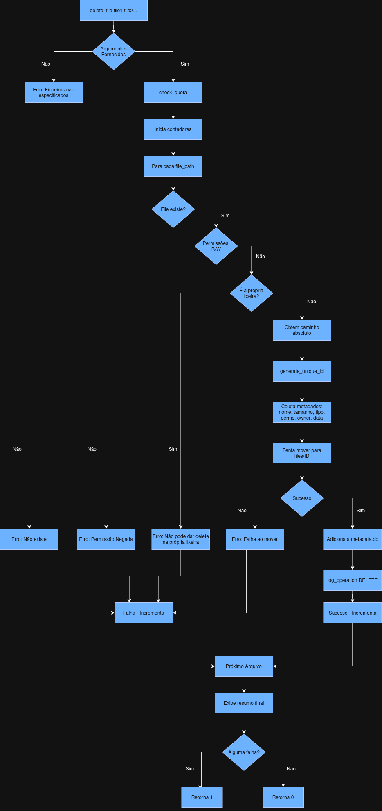

---

### Fluxograma da Operação `list_recycled`

Detalha como o script lê o `metadata.db` e formata a saída, incluindo a lógica de seleção para a vista normal (compacta) ou detalhada (`--detailed`).

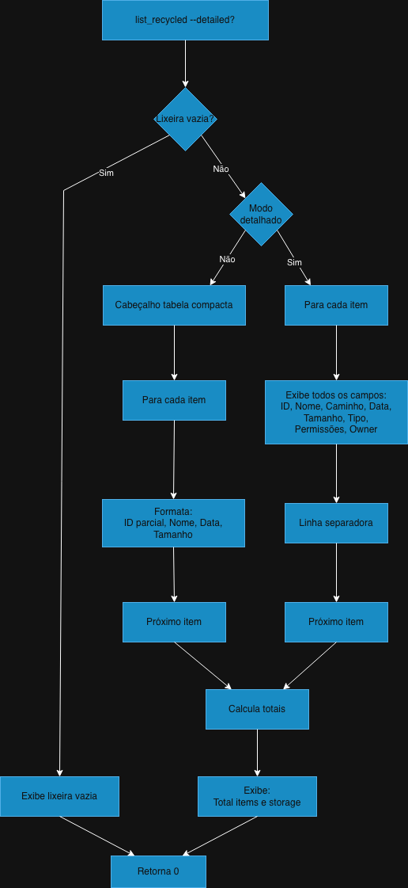

---

### Fluxograma da Operação `restore_file`

O fluxograma abaixo detalha a lógica de restauro, incluindo a pesquisa por ID ou nome, validação de resultados múltiplos e gestão de conflitos de ficheiros existentes.

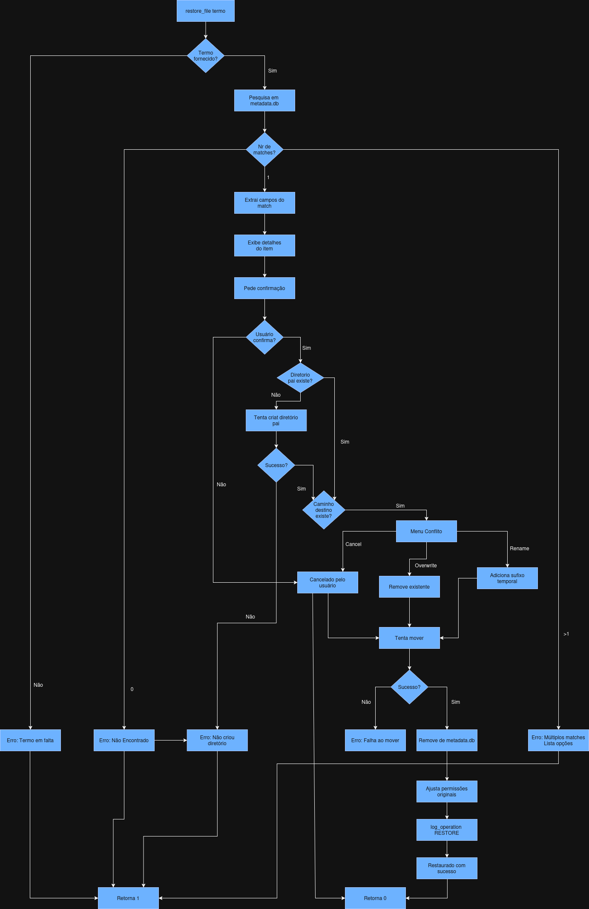

---

### Fluxograma da Operação `search_recycled`

Ilustra o processo de filtragem do `metadata.db` com base num padrão (usando `grep`/`regex`) e a apresentação formatada dos resultados correspondentes.

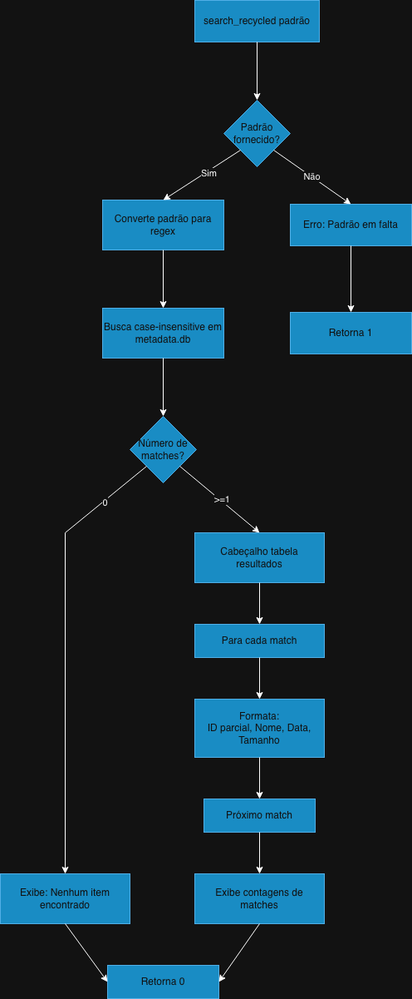

---

### Fluxograma da Operação `empty_recyclebin`

Descreve a lógica de eliminação permanente. Cobre os diferentes caminhos: esvaziamento total ou de um ID específico, e a verificação da flag `--force` para saltar a confirmação.

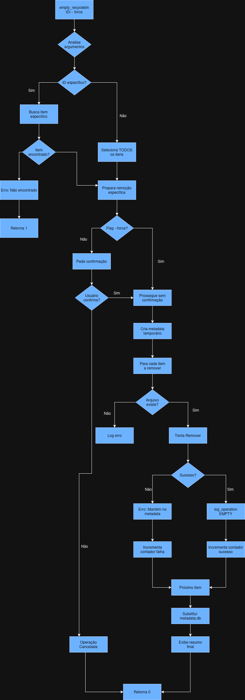

---

### Fluxograma da Operação `show_statistics`

Mostra como os dados são agregados a partir do `metadata.db` (contagem de itens, soma de tamanhos) e do `config` (quota) para calcular e apresentar o dashboard de estatísticas.

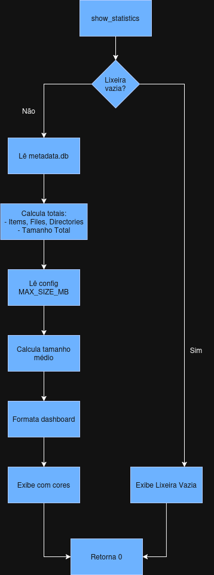

---

### Fluxograma da Operação `auto_cleanup`

Detalha o processo de limpeza automática, que lê o `RETENTION_DAYS` do `config`, calcula a data de corte e elimina permanentemente todos os itens mais antigos que essa data.

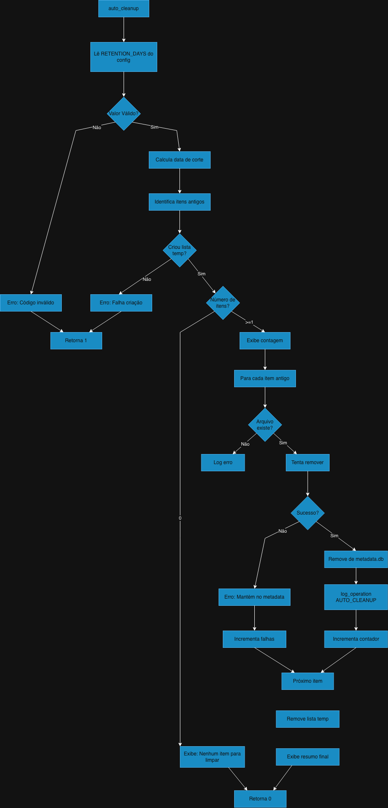

---

### Fluxograma da Operação `preview_file`

Ilustra a lógica de pré-visualização: encontrar o ficheiro pelo ID, verificar o seu tipo (MIME type) e mostrar as primeiras 10 linhas (para ficheiros de texto) ou informações gerais (para ficheiros binários).

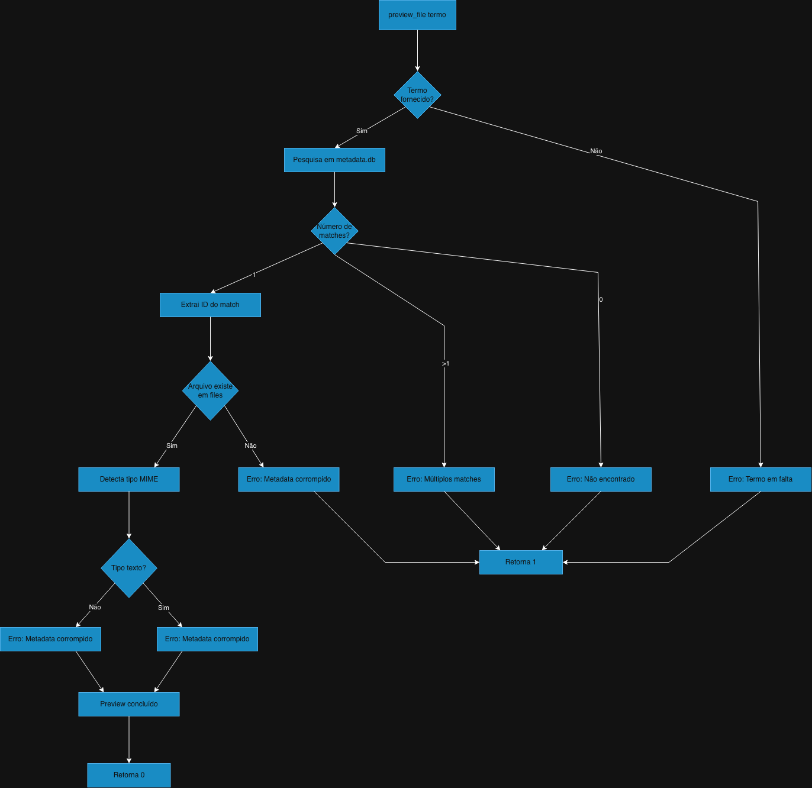

---

### Fluxograma da Operação `check_quota`

Descreve a função interna de verificação de quota, chamada pelo `delete_file`, que compara o tamanho total da lixeira com o `MAX_SIZE_MB` e emite os avisos apropriados.

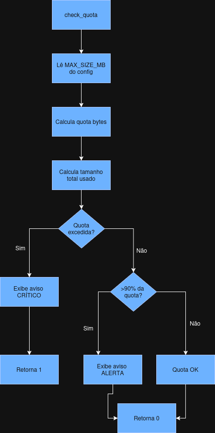

---

### Fluxograma da Operação `generate_unique_id`

Detalha a geração de um identificador único (baseado em timestamp e hash aleatório) para garantir que não existem colisões de nomes dentro da pasta `files/`.

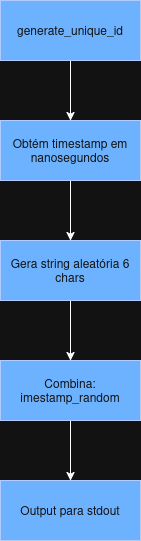

---

### Fluxograma da Operação `log_operation`

Descreve o processo simples de anexar (append) uma nova linha de texto formatada (com data e hora) ao ficheiro `recyclebin.log`.

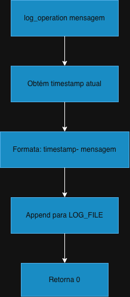

---

### Fluxograma da Operação `display_help`

Mostra o fluxo simples para imprimir o bloco de texto de ajuda (via `cat << EOF` ou `printf`) para o terminal.

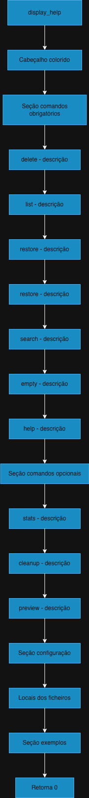

---

### Fluxograma da Operação `main`

Este é o ponto de entrada principal do script. Ele verifica o primeiro argumento do utilizador e, através de uma estrutura `case`, decide qual função principal (ex: `delete`, `list`, `restore`) deve ser executada. Também trata de erros de comandos inválidos e da chamada ao `initialize_recyclebin`.

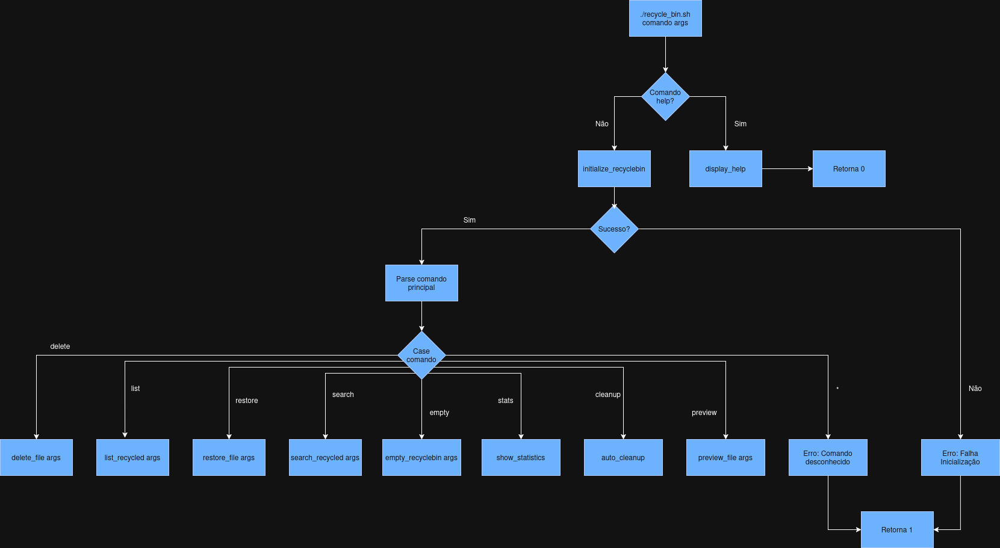

---

## 4. Descrição das Funções

Esta secção detalha cada função presente no script `recycle_bin.sh`.

### Funções Auxiliares

* `log_operation(message)`
    * **Descrição:** Adiciona uma entrada de log com timestamp ao ficheiro `recyclebin.log`.
    * **Parâmetros:** `$1` - A mensagem de log.
    * **Retorna:** 0.

* `generate_unique_id()`
    * **Descrição:** Gera um ID único globalmente para um item eliminado, combinando o timestamp em nanossegundos com 6 caracteres aleatórios (`timestamp_random`).
    * **Parâmetros:** Nenhum.
    * **Retorna:** Imprime o ID único para `stdout`.

### Funções Obrigatórias

* `initialize_recyclebin()`
    * **Descrição:** Função de arranque. Verifica se a estrutura `~/.recycle_bin/` existe. Se não existir, cria-a, incluindo a pasta `files/`, e os ficheiros `metadata.db` (com cabeçalho), `config` (com valores padrão), e `recyclebin.log`.
    * **Parâmetros:** Nenhum.
    * **Retorna:** 0 em sucesso, 1 se não conseguir criar as estruturas.

* `delete_file(path, ...)`
    * **Descrição:** A função principal de eliminação (Feature 2). Processa um ou mais ficheiros/diretórios, recolhe os seus metadados, move-os para a pasta `files/` com um ID único, e regista-os no `metadata.db`.
    * **Parâmetros:** `$1...$N` - Um ou mais caminhos para os itens a eliminar.
    * **Retorna:** 0 se todos os itens forem eliminados com sucesso, 1 se houver uma ou mais falhas.

* `list_recycled(flag)`
    * **Descrição:** Lista os conteúdos da lixeira (Feature 3) lendo o `metadata.db`.
    * **Parâmetros:** `$1` (Opcional) - Se for `--detailed`, mostra a informação completa. Caso contrário, mostra uma tabela compacta.
    * **Retorna:** 0.

* `restore_file(search_term)`
    * **Descrição:** Restaura um item da lixeira (Feature 4). Vê "Fluxograma da Operação `restore_file`" acima para detalhes. Gere conflitos se o ficheiro já existir.
    * **Parâmetros:** `$1` - O ID (parcial ou completo) ou nome do ficheiro a restaurar.
    * **Retorna:** 0 em sucesso, 1 em falha (não encontrado, conflito, etc.).

* `search_recycled(pattern)`
    * **Descrição:** Procura no `metadata.db` (Feature 5) por itens cujo nome ou caminho original correspondam a um padrão (suporta `*` como wildcard).
    * **Parâmetros:** `$1` - O padrão de pesquisa (ex: `*.txt`).
    * **Retorna:** 0.

* `empty_recyclebin(target_id, flag)`
    * **Descrição:** Remove permanentemente itens da lixeira (Feature 6). Suporta apagar tudo ou um item específico por ID. Pede confirmação, a menos que a flag `--force` seja usada.
    * **Parâmetros:** `$1` (Opcional) - ID do item a apagar. `$1` ou `$2` (Opcional) - `--force` para saltar a confirmação.
    * **Retorna:** 0.

* `display_help()`
    * **Descrição:** Imprime a mensagem de ajuda (Feature 7) com todos os comandos disponíveis e exemplos.
    * **Parâmetros:** Nenhum.
    * **Retorna:** 0.

### Funções Opcionais (Extra Credit)

* `show_statistics()`
    * **Descrição:** Lê o `metadata.db` e o `config` para calcular e apresentar um dashboard de estatísticas (Feature 8). Mostra o total de itens, uso de armazenamento, quota, e itens mais antigos/novos.
    * **Parâmetros:** Nenhum.
    * **Retorna:** 0.

* `auto_cleanup()`
    * **Descrição:** Implementa a Feature 9. Lê o `RETENTION_DAYS` do `config`. Apaga permanentemente todos os itens mais antigos que o período de retenção.
    * **Parâmetros:** Nenhum.
    * **Retorna:** 0.

* `check_quota()`
    * **Descrição:** Implementa a Feature 10. Função auxiliar (chamada por `delete_file`) que lê o `MAX_SIZE_MB` do `config` e o compara com o tamanho total. Imprime um aviso se a quota for excedida.
    * **Parâmetros:** Nenhum.
    * **Retorna:** 0 se OK, 1 se a quota for excedida.

* `preview_file(search_term)`
    * **Descrição:** Implementa a Feature 11. Encontra um item e mostra o seu conteúdo (se for texto) ou informação de tipo (se for binário).
    * **Parâmetros:** `$1` - O ID (parcial ou completo) ou nome do ficheiro a pré-visualizar.
    * **Retorna:** 0 em sucesso, 1 se não for encontrado.

### Função Principal

* `main(args)`
    * **Descrição:** O ponto de entrada do script. É responsável por:
        1.  Verificar o comando `help`.
        2.  Chamar `initialize_recyclebin`.
        3.  Analisar o comando principal (ex: `delete`, `list`) usando `case`.
        4.  Passar os argumentos restantes para a função correspondente.
    * **Parâmetros:** `$@` - Todos os argumentos passados para o script.

---

## 5. Decisões de Design e Racional

* **Implementação de Utilitários GNU/Linux**: O script foi desenvolvido nativamente para um ambiente GNU/Linux, utilizando os utilitários padrão e as suas flags específicas.
    * **`stat`**: Utiliza `stat -c` (GNU) para obter metadados (ex: `%a` para permissões, `%U:%G` para dono/grupo, `%s` para tamanho).
    * **`du`**: Utiliza `du -sb` (GNU) para obter o tamanho exato de diretórios em bytes.
    * **`date`**: Utiliza `date -d` (GNU) para cálculos de datas (ex: `date -d "30 days ago"` no `auto_cleanup`).
    * **`file`**: Utiliza `file -b --mime-type` (GNU) para identificar o tipo de ficheiro no `preview_file`.
    * **`tr`**: Utiliza `LC_CTYPE=C` ao `tr` em `generate_unique_id` para garantir a geração correta de strings aleatórias, independentemente do *locale* do sistema.

* **Ficheiro `metadata.db` em vez de Base de Dados (ex: SQLite)**: Foi escolhido um ficheiro CSV simples para os metadados, conforme os requisitos do projeto. Embora menos eficiente para um grande número de ficheiros, cumpre os requisitos usando ferramentas shell padrão (`grep`, `awk`, `tail`) sem dependências externas.

* **Lógica de Pesquisa (Restore/Preview)**: As funções `restore_file` e `preview_file` usam `grep -i` para pesquisar. Isto permite ao utilizador usar um ID parcial, o que melhora a usabilidade, pois os IDs completos são muito longos. O script trata de forma segura os casos de 0 ou múltiplas correspondências.

* **Gestão de Metadados no Restauro/Remoção**: Para remover uma linha do `metadata.db`, o script recria o ficheiro usando `grep -v "$ID_A_REMOVER"` e um ficheiro temporário. Esta é uma abordagem padrão e robusta em shell scripting.