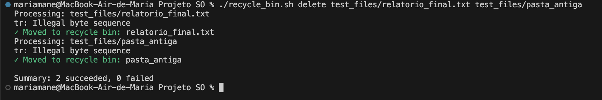
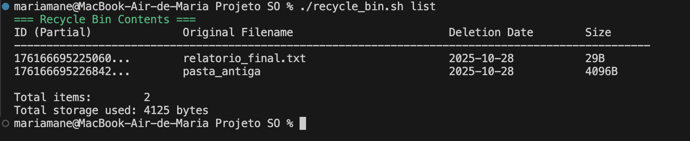
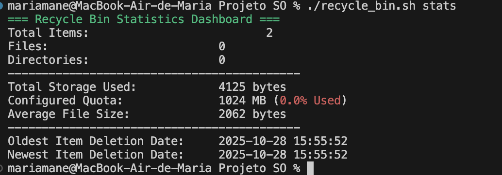
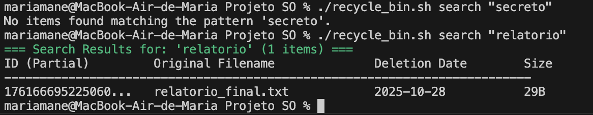
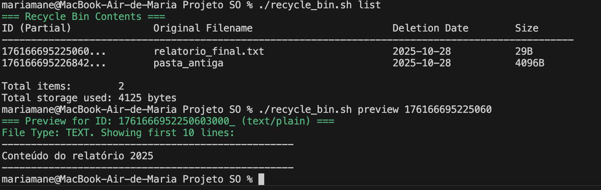
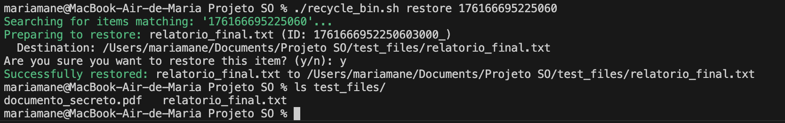
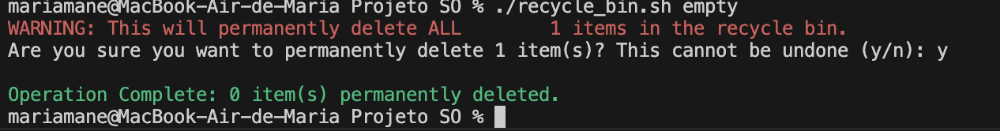
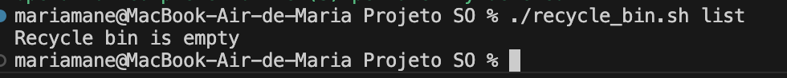
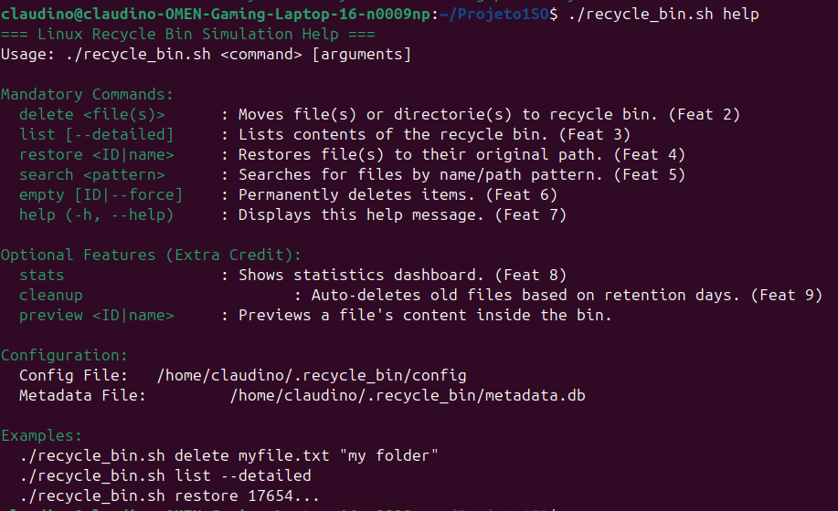

# Relatório de Testes: Simulação de Lixeira Linux

**Autores:**
* Maria Moreira Mané (Nº Mec: 125102)
* Claudino José Martins (Nº Mec: 127368)

Este documento detalha os procedimentos de teste e os resultados da simulação da lixeira, conforme os requisitos do Trabalho Prático 1 de Sistemas Operativos (2025/2026).

---

## 1. Testes Automatizados (`test_suite.sh`)

Foi utilizado um script de teste automatizado (`test_suite.sh`) para validar 20 cenários distintos, cobrindo a funcionalidade principal, casos de erro, segurança e robustez do script `recycle_bin.sh`.

### Resultado dos Testes Automatizados

O *test suite* foi executado com sucesso no **Linux**, com todos os sub-testes a passar, resultando numa taxa de sucesso de 100%. O output completo da execução dos testes está abaixo.

**Output Final do `test_suite.sh` (Linux):**

Recycle Bin System Test Suite
Total Tests: 20

Setting up test environment...
=== Test 1/20: Initialization ===
✓ PASS: Script executes without errors
✓ PASS: Recycle bin directory created
✓ PASS: Metadata file created
✓ PASS: Files directory created
✓ PASS: Config file created

=== Test 2/20: Delete Single File ===
Processing: ./test_data/test_file.txt
✓ Moved to recycle bin: test_file.txt

Summary: 1 succeeded, 0 failed
✓ PASS: Delete existing file
✓ PASS: File removed from original location
✓ PASS: File appears in recycle bin list

=== Test 3/20: Delete Multiple Files ===
Processing: ./test_data/multi1.txt
✓ Moved to recycle bin: multi1.txt
Processing: ./test_data/multi2.txt
✓ Moved to recycle bin: multi2.txt
Processing: ./test_data/multi3.txt
✓ Moved to recycle bin: multi3.txt

Summary: 3 succeeded, 0 failed
✓ PASS: Delete multiple files in one command
✓ PASS: First file removed
✓ PASS: Second file removed
✓ PASS: Third file removed

=== Test 4/20: Delete Directory ===
Processing: ./test_data/test_dir
✓ Moved to recycle bin: test_dir

Summary: 1 succeeded, 0 failed
✓ PASS: Delete directory with contents
✓ PASS: Directory removed from original location

=== Test 5/20: Delete Non-Existent File ===
Processing: ./test_data/nonexistent.txt

Summary: 0 succeeded, 1 failed
✓ PASS: Should fail on non-existent file

=== Test 6/20: List Functionality ===
✓ PASS: List command works
✓ PASS: Detailed list works

=== Test 7/20: List Empty Bin ===
✓ PASS: List shows empty bin message

=== Test 8/20: Restore Functionality ===
Processing: ./test_data/restore_me.txt
✓ Moved to recycle bin: restore_me.txt

Summary: 1 succeeded, 0 failed
✓ PASS: Restore file by ID (user cancelled)
✓ PASS: Restore file by ID
✓ PASS: File restored to original location

=== Test 9/20: Restore Non-Existent ID ===
Searching for items matching: 'nonexistent_id_123'...
✓ PASS: Should fail on non-existent ID

=== Test 10/20: Search Functionality ===
Processing: ./test_data/search_test.txt
✓ Moved to recycle bin: search_test.txt

Summary: 1 succeeded, 0 failed
✓ PASS: Search by filename works
✓ PASS: Search with wildcard works
✓ PASS: Search for non-existent pattern handles gracefully

=== Test 11/20: Empty Functionality ===
✓ PASS: Empty with force flag
✓ PASS: Bin is empty after emptying

=== Test 12/20: Empty Specific ID ===
✓ PASS: Empty specific file by ID

=== Test 13/20: Statistics Functionality ===
✓ PASS: Stats command works

=== Test 14/20: Preview Functionality ===
✓ PASS: Preview command works

=== Test 15/20: Help Functionality ===
✓ PASS: Help command works
✓ PASS: --help flag works
✓ PASS: -h flag works

=== Test 16/20: Files with Spaces ===
Processing: ./test_data/file with spaces.txt
✓ Moved to recycle bin: file with spaces.txt

Summary: 1 succeeded, 0 failed
✓ PASS: Delete file with spaces in name
✓ PASS: File with spaces removed

=== Test 17/20: Quota Management ===

=== Test 18/20: Auto-Cleanup ===
✓ PASS: Auto-cleanup command works

=== Test 19/20: Security Validation ===
Processing: /home/claudino/.recycle_bin

Summary: 0 succeeded, 1 failed
✓ PASS: Should prevent deleting recycle bin itself

=== Test 20/20: Concurrent Operations Protection ===
✓ PASS: Concurrent operations handled gracefully

Cleaning up test environment...

FINAL TEST RESULTS:
  38 tests passed
  0 tests failed
  Total: 38 tests executed
  Success rate: 100%

 ALL TESTS PASSED! Your recycle bin system is working perfectly!

 ## 2. Testes Manuais (Para Screenshots)

Foram executados testes manuais para demonstrar visualmente as funcionalidades obrigatórias e opcionais do script.

### Teste Manual 1: Operação `delete`

* **Objetivo:** Validar que o comando `delete` move múltiplos ficheiros e pastas para a lixeira.
* **Passos:**
    1.  Criar `test_files/relatorio_final.txt` e `test_files/pasta_antiga`.
    2.  Executar `./recycle_bin.sh delete test_files/relatorio_final.txt test_files/pasta_antiga`.
* **Resultado Esperado:** O script deve confirmar que ambos os itens foram movidos para a lixeira com sucesso.
* **Resultado Atual:** Sucesso.
* **Status:** **PASS**
* **Screenshot:**

    

### Teste Manual 2: Operação `list`

* **Objetivo:** Validar que o comando `list` apresenta corretamente os itens na lixeira.
* **Passos:**
    1.  Executar `./recycle_bin.sh list` após o Teste 1.
* **Resultado Esperado:** A tabela deve listar `relatorio_final.txt` e `pasta_antiga` com os seus metadados.
* **Resultado Atual:** Sucesso.
* **Status:** **PASS**
* **Screenshot:**

    

### Teste Manual 3: Operação `stats` (Opcional)

* **Objetivo:** Validar que o comando `stats` apresenta o dashboard de estatísticas.
* **Passos:**
    1.  Executar `./recycle_bin.sh stats` após o Teste 1.
* **Resultado Esperado:** O dashboard deve mostrar "Total Items: 2", "Files: 1", "Directories: 1", e o uso total de armazenamento.
* **Resultado Atual:** Sucesso.
* **Status:** **PASS**
* **Screenshot:**

    

### Teste Manual 4: Operação `search`

* **Objetivo:** Validar que o comando `search` filtra corretamente os itens na lixeira.
* **Passos:**
    1.  Executar `./recycle_bin.sh search "relatorio"`.
* **Resultado Esperado:** A lista de resultados deve mostrar apenas a entrada para `relatorio_final.txt`.
* **Resultado Atual:** Sucesso.
* **Status:** **PASS**
* **Screenshot:**

    

### Teste Manual 5: Operação `preview` (Opcional)

* **Objetivo:** Validar que o comando `preview` mostra o conteúdo de um ficheiro de texto.
* **Passos:**
    1.  Obter o ID parcial de `relatorio_final.txt` (ex: `176...`) a partir do comando `list`.
    2.  Executar `./recycle_bin.sh preview 176...`.
* **Resultado Esperado:** O script deve mostrar as primeiras 10 linhas do ficheiro `relatorio_final.txt`.
* **Resultado Atual:** Sucesso.
* **Status:** **PASS**
* **Screenshot:**

    

### Teste Manual 6: Operação `restore`

* **Objetivo:** Validar que o comando `restore` restaura um item para a sua localização original.
* **Passos:**
    1.  Obter o ID parcial de `relatorio_final.txt`.
    2.  Executar `./recycle_bin.sh restore 176...`.
    3.  Confirmar com `y`.
* **Resultado Esperado:** O script deve confirmar o restauro, e o ficheiro deve reaparecer na pasta `test_files/`.
* **Resultado Atual:** Sucesso.
* **Status:** **PASS**
* **Screenshot:**

    

### Teste Manual 7: Operação `empty`

* **Objetivo:** Validar que o comando `empty` apaga permanentemente os itens restantes.
* **Passos:**
    1.  Executar `./recycle_bin.sh empty`.
    2.  Confirmar com `y`.
* **Resultado Esperado:** O script deve pedir confirmação e, de seguida, apagar o item `pasta_antiga`.
* **Resultado Atual:** Sucesso.
* **Status:** **PASS**
* **Screenshot:**

    

### Teste Manual 8: Verificação Final (`list` Vazia)

* **Objetivo:** Validar que a lixeira está vazia após a operação `empty`.
* **Passos:**
    1.  Executar `./recycle_bin.sh list` após o Teste 7.
* **Resultado Esperado:** O script deve reportar "Recycle bin is empty".
* **Resultado Atual:** Sucesso.
* **Status:** **PASS**
* **Screenshot:**

    

### **Teste Manual 9: Operação `help`**

* **Objetivo:** Validar que o comando `help` mostra corretamente a informação de ajuda.
* **Passos:**
    1.  Executar `./recycle_bin.sh help`.
* **Resultado Esperado:** O script deve mostrar a lista completa de comandos, opções e exemplos de utilização.
* **Resultado Atual:** Sucesso.
* **Status:** **PASS**
* **Screenshot:**

    